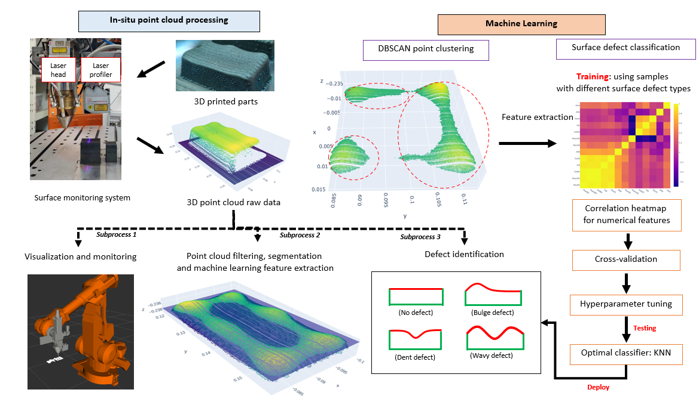
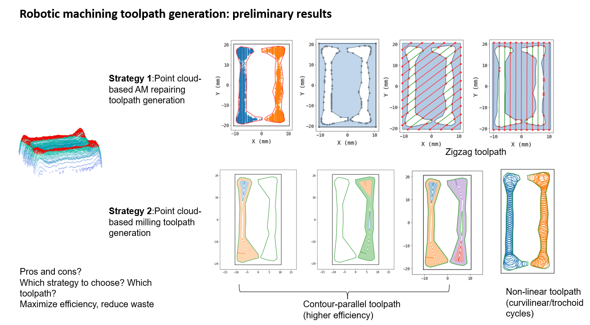
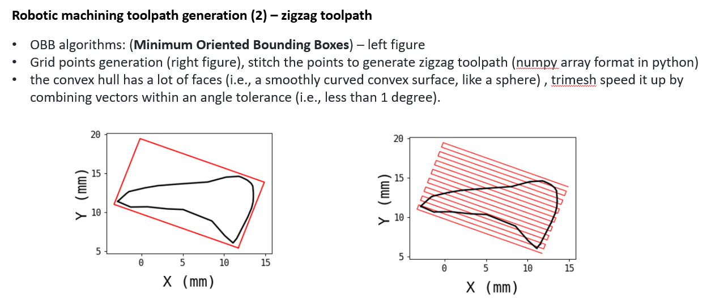

# In-process adaptive defect correction for robotic hybrid LAAM
### Summary
On-machine laser scanning and in-process adaptive dimension deviation (surface defect) correction strategy

- On-machine laser scanning measurement to generate point cloud data
- Point cloud processing
- Rapid surface defect identification
- Repair AM part surface defect based on point cloud data
- Automatic repairing AM toolpath generation

Currently in development: 
- Localized surface defect identification
- Surface defect removal by robotic milling process
- Various stratagies for generating robotic milling toolpath pattern
- Robotic milling toolpath selection (decision-making)
- Hybrid process planning (surface defect repair by AM or SM)

# Introduction
This is the code repository for a series of projects related to __In-process adaptive defect correction for robotic hybrid LAAM__

## Table of Contents
- [Rapid surface defect identification](#rapid-surface-defect-identification)
- [In-process adaptive dimension correction strategy for LAAM](#in-process-adaptive-dimension-correction-strategy-for-laam)

## [Rapid surface defect identification] 

[Rapid surface defect identification]: ./Rapid_surface_defect_id

#### Citation
If you find our work useful in your research, please cite our paper:

<!-- [Publication](https://www.tandfonline.com/doi/full/10.1080/17452759.2020.1832695): -->

  Chen, L., Yao, X., Xu, P., Moon, S.K., Bi, G., 2021. Rapid surface defect identification for additive manufacturing with in-situ point cloud processing and machine learning. Virtual and Physical Prototyping 16, 50–67. https://doi.org/10.1080/17452759.2020.1832695

##  [In-process adaptive dimension correction strategy for LAAM]

[In-process adaptive dimension correction strategy for LAAM]: ./Dimensional_correction_paper_source_code

paper entitled "In-process adaptive dimension correction strategy for laser aided additive manufacturing using laser line scanning"
#### Citation
If you find our work useful in your research, please cite our paper:

<!-- [Publication](https://www.mdpi.com/2076-3417/10/22/7967):

   Chen L, Yao X, Chew Y, Weng F, Moon SK, Bi G. Data-Driven Adaptive Control for Laser-Based Additive Manufacturing with Automatic Controller Tuning. Applied Sciences. 2020; 10(22):7967. https://doi.org/10.3390/app10227967 -->

<!-- 

  

 -->

##  [Robotic milling toolpath generation]

- Currently under development
- Preliminary results:

